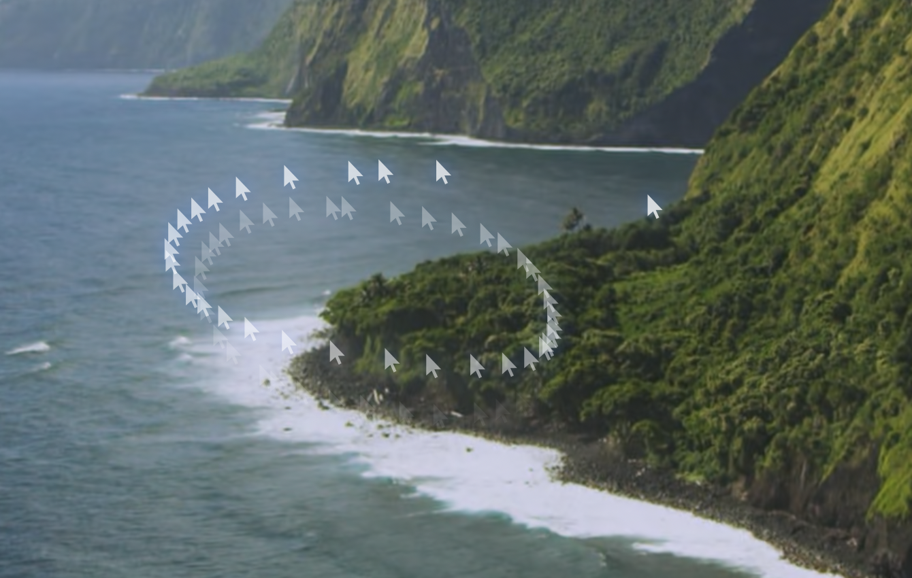
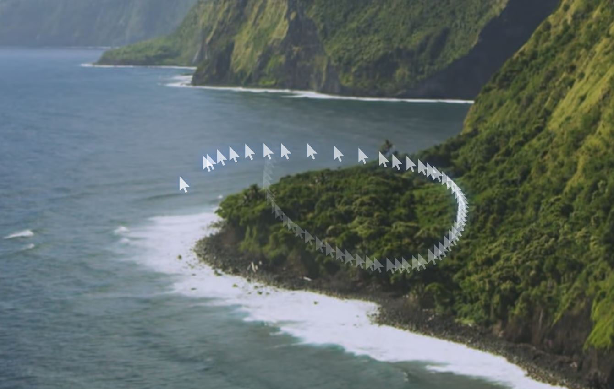
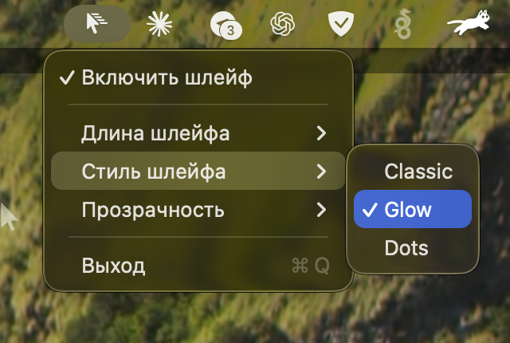

# CursorTrail 🖱️✨

**CursorTrail** is a tiny nostalgic macOS menu-bar app that adds a smooth fading trail behind your mouse cursor — inspired by the classic Windows 2000s cursor trail effect.

**CursorTrail** — маленькое menu-bar приложение для macOS, которое добавляет плавно исчезающий «шлейф» за курсором мыши, как в старых версиях Windows. Простая визуальная утилита без внешних зависимостей.

> The app is a local visual utility and does not record or transmit cursor activity.

---

## 🇷🇺 Описание на русском

CursorTrail рисует аккуратный шлейф за курсором поверх окон macOS. Приложение живёт в menu bar, не мешает кликам, не требует токенов, аккаунтов, серверов или внешних библиотек.

Проект сделан как простой pet-project / portfolio-project: один файл Swift, один скрипт сборки и понятная инструкция запуска.

---

## 📸 Preview / Скриншоты

### Trail effect / Эффект шлейфа





### Menu bar controls / Меню приложения



> Put screenshots into `docs/screenshots/` with the exact filenames shown above.  
> Скриншоты нужно класть в `docs/screenshots/` с такими же именами файлов.

---

## ✨ Features / Возможности

- 🖱️ Smooth fading cursor trail / плавный шлейф за курсором
- 🧊 Classic nostalgic Windows-style effect / ностальгический эффект как в Windows 2000-х
- 🌗 Trail styles: Classic, Glow, Dots / стили: Classic, Glow, Dots
- 📏 Trail length: Short, Medium, Long / длина: Short, Medium, Long
- 👻 Adjustable opacity / настройка прозрачности
- 🖥️ Multi-display support / поддержка нескольких мониторов
- 📌 Menu-bar controls / управление из menu bar
- 💾 Settings saved with UserDefaults / настройки сохраняются
- 🚫 No external dependencies / без внешних зависимостей
- ⚡ Lightweight native macOS app / лёгкое нативное приложение

---

## 📦 Project structure / Структура проекта

```text
CursorTrail/
├── CursorTrail.swift
├── build.sh
├── README.md
├── LICENSE
├── .gitignore
└── docs/
    └── screenshots/
        ├── preview-trail-classic.png
        ├── preview-trail-glow.png
        └── preview-menu.png
```

---

## 🛠️ Requirements / Требования

You only need Apple Command Line Tools:

```bash
xcode-select --install
```

Нужны только Command Line Tools от Apple. Полный Xcode не обязателен.

---

## 🚀 Build and run / Сборка и запуск

Clone the repository:

```bash
git clone https://github.com/oleg-titov-ai/CursorTrail.git
cd CursorTrail
```

Build the app:

```bash
chmod +x build.sh
./build.sh
```

Run it:

```bash
open CursorTrail.app
```

После запуска в правой части menu bar появится иконка CursorTrail.

---

## ⚙️ Menu options / Меню

CursorTrail lives in the macOS menu bar.

Доступные настройки:

- Enable / Disable trail
- Trail length: Short / Medium / Long
- Trail style: Classic / Glow / Dots
- Opacity: Low / Medium / High
- Quit

Settings are saved automatically.

---

## 🔐 Permissions / Разрешения

CursorTrail does not use accounts, passwords, tokens, servers, analytics or external APIs.

CursorTrail не использует аккаунты, пароли, токены, серверы, аналитику или внешние API.

---

## 🧠 How it works / Как это работает

The app uses standard macOS APIs:

- Swift
- AppKit / Cocoa
- QuartzCore
- NSStatusItem
- transparent overlay window
- custom drawing
- UserDefaults

Приложение написано максимально просто: один Swift-файл, menu-bar интерфейс, прозрачное окно для отрисовки и сохранение настроек через UserDefaults.

---

## 🧪 Known limitations / Ограничения

- The trail may not appear over some fullscreen apps or games.
- Behavior can vary depending on macOS fullscreen Spaces.
- The app is locally signed with ad-hoc signing during build, not with a paid Apple Developer certificate.

На русском:

- В некоторых полноэкранных приложениях или играх шлейф может не отображаться.
- Поведение может отличаться в fullscreen Spaces macOS.
- Приложение подписывается локальной ad-hoc подписью, а не платным Apple Developer сертификатом.

---

## 🧹 Uninstall / Удаление

Quit CursorTrail from the menu bar, then remove the app:

```bash
rm -rf CursorTrail.app
```

Remove saved settings:

```bash
defaults delete com.local.cursortrail
```

---

## 🗺️ Roadmap / Идеи для развития

- [ ] Custom trail colors / свои цвета шлейфа
- [ ] More trail shapes / больше форм
- [ ] Launch at login / автозапуск
- [ ] Settings window / отдельное окно настроек
- [ ] Signed release build / подписанный релиз
- [ ] DMG installer / DMG-установщик

---

## 🤝 Contributing

Pull requests are welcome.

The goal is to keep this project simple, readable and dependency-free.

---

## 📄 License

MIT License.

Feel free to use, modify and share.
